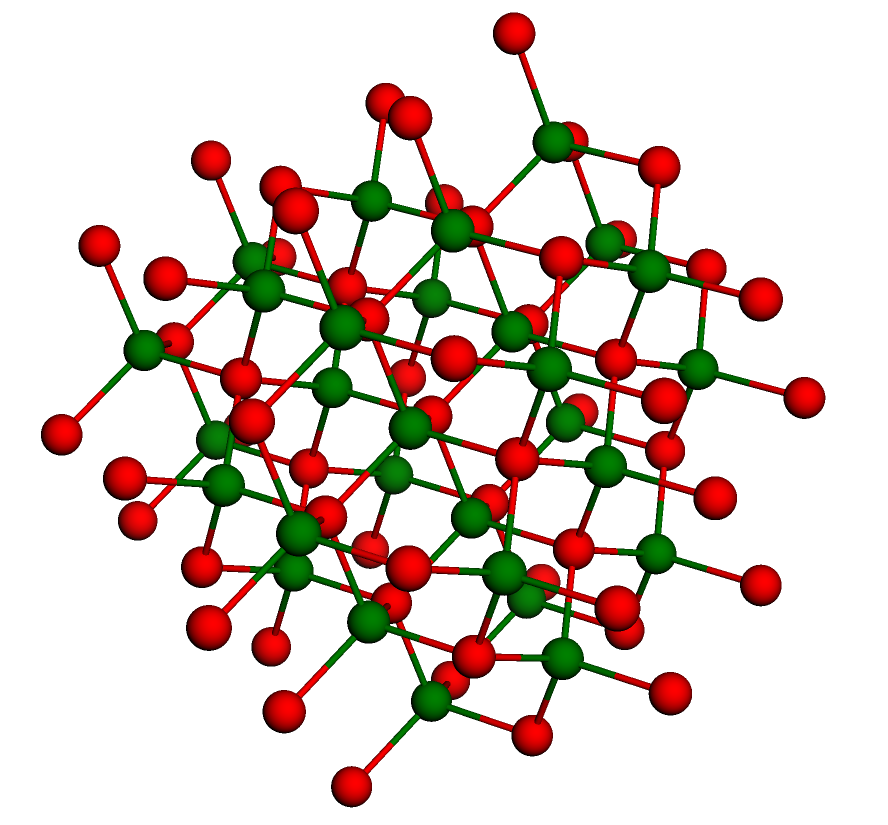

# Residual entropy of ice

## Links

- [Live webpage on GitLab Pages](https://bmares.gitlab.io/ice-residual-entropy)
- [GitLab repository](https://gitlab.com/bmares/ice-residual-entropy)
- [GitHub repository](https://github.com/maresb/ice-residual-entropy)

## [Click for interactive model:](https://bmares.gitlab.io/ice-residual-entropy)

- [Live webpage on GitLab Pages](https://bmares.gitlab.io/ice-residual-entropy)

## Description

I'm interested in exploring [ice-type models](https://en.wikipedia.org/wiki/Ice-type_model) and their residual entropy.

There are many various [phases of ice](https://en.wikipedia.org/wiki/Ice#Phases). Currently, I have a visualization of (the oxygen atoms of) [Ice Ih](https://en.wikipedia.org/wiki/Ice_Ih), which is ordinary ice, [Ice Ic](https://en.wikipedia.org/wiki/Ice_Ic) and [square ice](https://journals.aps.org/pr/abstract/10.1103/PhysRev.162.162).

## Notes

The oxygen atoms of each of the ice type have a crystal structure. The "ice rule" applies to each ice type because the underlying graph of neighboring oxygen atoms is 4-valent (each oxygen atom has 4 neighboring oxygen atoms).

Since the 3D crystal structure does not involve the hydrogen, equivalent crystal structures are more often discussed in the context of different atoms in a 4-valent arrangement. For example, the oxygen atoms in cubic ice are arranged in a [diamond cubic structure](https://en.wikipedia.org/wiki/Diamond_cubic).

Each of the underlying graphs happen to be bipartite (neighboring oxygen atoms can be given alternating colors).

The structure of the underlying graphs can be distinguished by the respective [coordination sequences](https://en.wikipedia.org/wiki/Coordination_sequence), whose _n_-th element is the number of vertices which are a distance of _n_ steps from a chosen vertex. These are:

- Square: 1, 4, 8, 12, 16, 20, 24, ... ([A008574](https://oeis.org/A008574))
- Cubic (diamond): 1, 4, 12, 24, 42, 64, 92, ...([A008253](https://oeis.org/A008253))
- Hexagonal (lonsdaleite): 1, 4, 12, 25, 44, 67, 96, ... ([A008264](https://oeis.org/A008264))

(Each coordination sequence begins with 1, 4, since the graphs are all 4-valent.)

It is also interesting to consider the [theta functions](https://en.wikipedia.org/wiki/Theta_function_of_a_lattice), which are the generating functions for the number of points of a given Euclidean squared-distance from a chosen point. These are:

- Square: = 1 + 4 q + 4 q^2 + 4 q^4 + 8 q^5 + 4 q^8 + 4 q^9 + 8 q^10 + ... =  _θ₃(q)²_ ([Jacobi theta](https://en.wikipedia.org/wiki/Theta_function#Auxiliary_functions))
- Cubic (diamond): 1 + 4 q^9 + 12 q^24 + 12 q^33 + 6 q^48 + 12 q^57 + 24 q^72 + ...
- Hexagonal (lonsdaleite): 1 + 4 q^9 + 12 q^24 + q^25 + 9 q^33 + 6 q^48 + 6 q^49 + 9 q^57 +  2 q^64 + 18 q^72 +  + 9 q^81 + 12 q^88 + 3 q^89 + 6 q^96 + 6 q^97 + 18 q^105 + 3 q^113 + 12 q^120 + 7 q^121 + 3 q^129 + 12 q^136 + 6 q^137 + 6 q^144 + 6 q^145 + 6 q^152 + 12 q^153 + 12 q^160 + 24 q^168 + q^169 ...

Formulas for the theta functions for diamond and lonsdaleite structures were worked out by [Sloane](http://neilsloane.com/doc/Me137.pdf). Diamond is ½(θ₂(q¹²)³ + θ₃(q¹²)³ + θ₄(q¹²)³, while lonsdaleite has a rather messy formula, Eq. (20).
